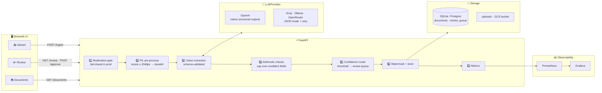
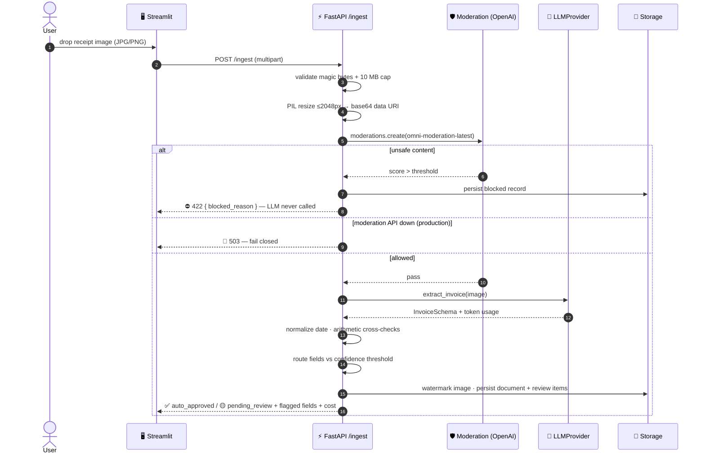
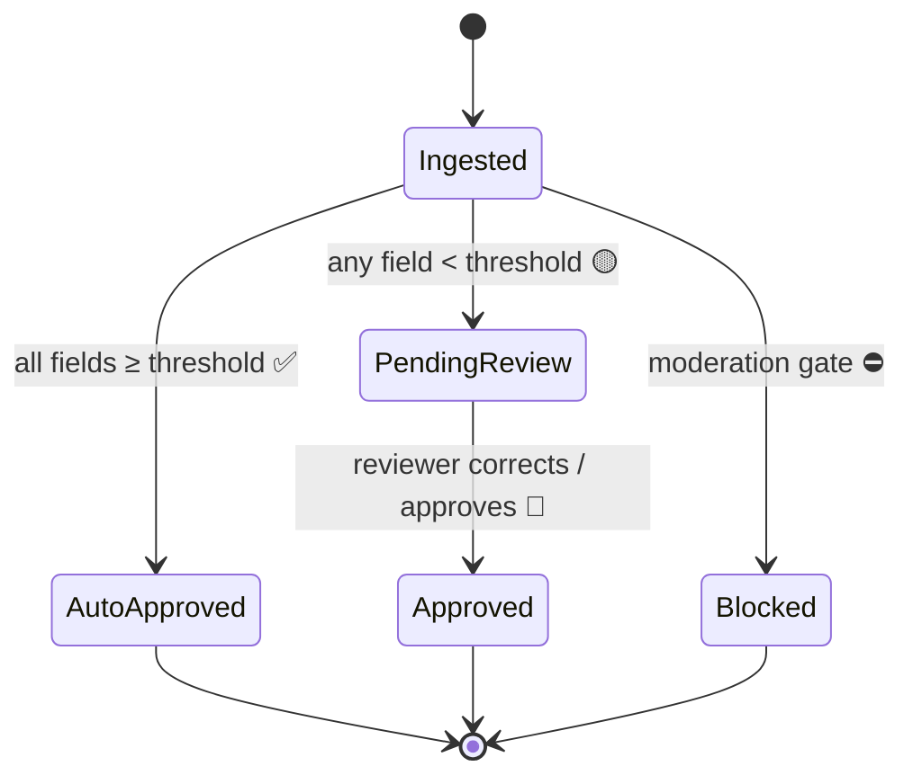
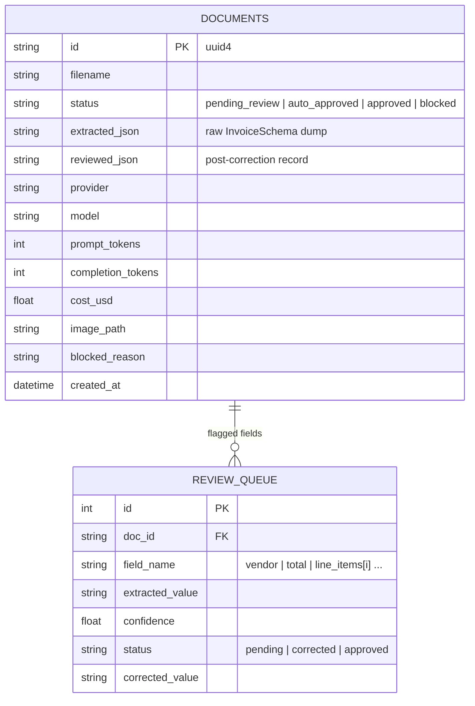
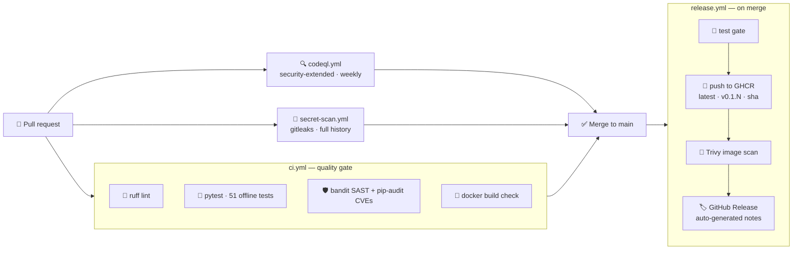

<div align="center">

# 🧾 LedgerLens

### Document Intelligence for Receipts & Invoices

**Drop in a photo of any receipt or invoice → get schema-validated structured data, per-field confidence scores, and a human review queue for anything the model isn't sure about. No custom parser per vendor, ever.**

[](https://github.com/sinalkar/LedgerLens-Document-Intelligence-/actions/workflows/ci.yml)
[](https://github.com/sinalkar/LedgerLens-Document-Intelligence-/actions/workflows/codeql.yml)
[](https://github.com/sinalkar/LedgerLens-Document-Intelligence-/actions/workflows/release.yml)
[](https://github.com/sinalkar/LedgerLens-Document-Intelligence-/actions/workflows/secret-scan.yml)


</div>

---

## 💡 Why LedgerLens

Finance and operations teams at small companies spend hours every month manually keying invoice and receipt data into spreadsheets. Template-based OCR breaks the moment a supplier changes their layout. A vision-language model reads *any* heterogeneous document without a layout template — but raw LLM output is fragile: amounts arrive as strings, dates are ambiguous, and models occasionally hallucinate a line item rather than admit uncertainty.

**The hard part is reliability.** A document-intelligence product that auto-approves every extraction is a liability. LedgerLens' answer:

| 🛡️ | **Schema contracts** | Pydantic-enforced output — the shape is always correct, or the request fails loudly |
|---|---|---|
| 🎯 | **Per-field confidence** | Every field carries a 0–1 certainty score set by the model *and cross-checked by arithmetic* |
| 👤 | **Uncertainty routing** | Fields below the threshold go to a human review queue — never silently into the ledger |
| 🔢 | **Trust, but verify** | If `subtotal + tax ≠ total` or line items don't sum, confidence is capped regardless of what the model claims |

> *The system knows what it doesn't know.* That combination — structured extraction with explicit uncertainty routing — is the pattern companies like Ramp, Brex, and Klarna ship in production.

---

## 🏗️ Architecture



**Design principle:** every provider-specific decision lives behind one interface — `LLMProvider`. The rest of the app (routing, redaction, storage, metrics) never knows which vendor served the model. Switching vendors is a one-line `.env` edit + restart.

---

## 🔄 Ingest sequence



---

## 🚦 Review lifecycle



The confidence router is a pure function — zero I/O — so the heart of the product is trivially unit-testable:

```python
status, flagged = route_fields(invoice, threshold=0.75)
# ("pending_review", ["vendor", "total", "line_items[2]"])
```

---

## 🤖 Provider matrix

All four providers speak the OpenAI SDK wire format — swap `base_url` + key, keep one client. What differs is enforced per provider:

| Capability | OpenAI | Groq | Ollama | OpenRouter |
|---|:---:|:---:|:---:|:---:|
| 👁️ Vision input | ✅ | ✅ Llama vision | ✅ llama3.2-vision / llava | ✅ model-dependent |
| 📐 Structured outputs | ✅ native Pydantic parse | 🔁 JSON mode + retry | 🔁 JSON mode + retry | 🔁 JSON mode + retry |
| 🛡️ Moderation endpoint | ✅ omni-moderation | ❌ | ❌ | ❌ |
| 💰 Cost | $$ | free tier | free (local) | varies |

Two consequences drive the design:

1. **Structured-output strategy is per-provider.** OpenAI gets native `response_format=InvoiceSchema`. Everyone else gets JSON mode + `model_validate_json()` + a bounded retry loop that feeds the validation error back into the prompt — models fix their own JSON well. Same schema guarantee at the boundary, different enforcement path.
2. **Moderation is decoupled from extraction.** Only OpenAI has an image moderation endpoint, so `MODERATION_BACKEND` is independent of `LLM_PROVIDER` — Groq for cheap extraction + OpenAI for moderation is a first-class configuration. `off` is dev-only and **rejected in production** at startup.

> ⚠️ Vision-capable model names on Groq/OpenRouter change frequently — verify availability and set `EXTRACTION_MODEL` accordingly.

---

## 🚀 Quickstart

```bash
git clone https://github.com/sinalkar/LedgerLens-Document-Intelligence-.git
cd LedgerLens-Document-Intelligence-
cp .env.example .env          # add your OpenAI key
pip install -r requirements.txt

uvicorn app.main:app --port 8080          # API
streamlit run ui/streamlit_app.py         # UI (second terminal)
```

**Full local stack** — API + UI + Prometheus + Grafana:

```bash
docker compose up --build
```

| Service | URL |
|---|---|
| ⚡ API + docs | http://localhost:8080/docs |
| 🖥️ Streamlit UI | http://localhost:8501 |
| 📈 Prometheus | http://localhost:9090 |
| 📊 Grafana | http://localhost:3000 |

**Or run the released image** (published on every merge to `main`):

```bash
docker pull ghcr.io/sinalkar/ledgerlens-document-intelligence-:latest
docker run --env-file .env -p 8080:8080 ghcr.io/sinalkar/ledgerlens-document-intelligence-:latest
```

### ⚙️ Key configuration (`.env`)

| Variable | Default | Purpose |
|---|---|---|
| `LLM_PROVIDER` | `openai` | `openai` · `groq` · `ollama` · `openrouter` |
| `EXTRACTION_MODEL` | `gpt-4o-mini` | Vision-capable model for the chosen provider |
| `MODERATION_BACKEND` | `openai` | `openai` or `off` (dev only — rejected in prod) |
| `REVIEW_CONFIDENCE_THRESHOLD` | `0.75` | Fields below this go to human review |
| `MAX_IMAGE_DIMENSION` | `2048` | Resize cap before the vision call (cost control) |
| `STORAGE_BACKEND` | `local` | `local` or `gcs` (required in prod — Cloud Run FS is ephemeral) |
| `DATABASE_URL` | `sqlite:///./ledgerlens.db` | Any SQLAlchemy URL (Postgres for prod) |
| `ENVIRONMENT` | `development` | `production` activates fail-closed + storage guards |

Misconfiguration (missing key, moderation off in prod, local storage on ephemeral infra) kills the app **at startup** with a readable error — never on the first request.

---

## 📡 API reference

| Method | Endpoint | Purpose |
|:---:|---|---|
| `POST` | `/ingest` | Upload one JPEG/PNG (≤10 MB) → full pipeline → status + extraction + flagged fields + cost |
| `POST` | `/batch` | Upload many images → processed sequentially → **CSV summary** per document |
| `GET` | `/review` | Pending review items (field, extracted value, confidence, image URL) |
| `POST` | `/approve` | Submit corrections; drains the doc's queue and marks it `approved` |
| `GET` | `/documents` | Paginated list of processed documents |
| `GET` | `/documents/{id}` | Full record incl. reviewed values |
| `GET` | `/documents/{id}/image` | Watermarked image (signed GCS URL in prod) |
| `GET` | `/health` | DB ping + active provider + provider health |
| `GET` | `/metrics` | Prometheus scrape endpoint |

A moderation block returns **422** with `{"blocked_reason": ...}` — the LLM is never called for blocked content.

---

## 🗃️ Data model



The extraction schema keeps confidence **next to each field** (`vendor` + `vendor_confidence`) rather than nested `{value, confidence}` objects — flat JSON is far more reliable for weaker JSON-mode models. Dates are normalized post-hoc (`dateutil`), so a weird format degrades to low confidence instead of a hard failure.

---

## 🔐 Safety rails

- 🛡️ **Moderation gate** before any LLM call — `omni-moderation-latest` with structured image input; fail-**closed** in production (503), fail-open in dev.
- 🕵️ **PII redaction at the sink** — a `logging.Filter` on the root logger scrubs SSNs, emails, phone numbers, and card numbers from *every* record, so no call site can forget. The DB keeps the unredacted extraction (it's the business record); only logs are redacted.
- 🧾 **Upload validation** by magic bytes (extensions lie), 10 MB cap, JPEG/PNG only.
- 🖋️ **Provenance watermark** — every stored image is stamped with doc id + timestamp (gray, ~10% opacity, bottom-right).
- ➗ **Arithmetic cross-checks** cap confidence when the numbers don't add up — independent of the model's self-report.

---

## 📊 Observability

| Metric | Type | Meaning |
|---|---|---|
| `extraction_latency_seconds` | Histogram | Vision extraction latency (p50/p95/p99 on the dashboard) |
| `moderation_latency_seconds` | Histogram | Moderation gate latency |
| `token_cost_usd_total` | Counter | Cumulative LLM spend |
| `documents_processed_total{status}` | Counter | Docs by outcome |
| `moderation_blocks_total` | Counter | Uploads stopped at the gate |
| `auto_approvals_total` | Counter | Docs fully auto-approved |
| `review_queue_depth` | Gauge | Pending human-review items |
| `throughput_docs_per_minute` | Gauge | Rolling one-minute throughput |

The provisioned Grafana dashboard ships with panels for latency percentiles, cost per document, cumulative spend, throughput, queue depth, and the headline **auto-approval rate** — the direct measure of human labor saved. It moves when you tune the threshold or swap providers.

---

## 🔁 CI/CD pipeline



Every merge to `main` ships a versioned **GitHub Release** and a **GHCR image** — no cloud-provider lock-in; the image runs anywhere (`docker run`, Cloud Run, Render, Railway, a VM). Authentication uses the built-in `GITHUB_TOKEN`; zero secrets to configure. Full details: [docs/CI_CD.md](docs/CI_CD.md).

If you deploy to Cloud Run or similar, its filesystem is **ephemeral**: production requires `STORAGE_BACKEND=gcs` (config validation enforces this) and a persistent `DATABASE_URL`.

---

## 🧪 Testing

```bash
pytest tests/ -v        # 51 tests, zero network calls, no API keys needed
```

All tests run offline via a `FakeProvider`. Coverage highlights:

| Area | What's asserted |
|---|---|
| Schema contracts | JSON round-trip; confidence bounds (`1.2` → `ValidationError`); missing `total` rejected |
| Confidence router | `0.74` flagged / `0.76` not; all-high → `auto_approved`; `line_items[i]` naming |
| Arithmetic checks | `subtotal + tax ≠ total` caps confidence at 0.5; consistent numbers untouched |
| Moderation gate | block → 422 and **provider never called**; prod error → 503 (fail closed); dev error → fail open |
| Redaction | every PII pattern replaced; the logging filter scrubs records; clean text untouched |
| Watermark | bottom-right pixels differ, dimensions unchanged, top-left untouched |
| Provider factory | each `LLM_PROVIDER` → right class; missing key → startup `RuntimeError`; JSON-mode retry recovers from one bad JSON |
| Review flow | end-to-end ingest → queue → approve with corrections → document `approved` |
| Batch mode | per-file CSV rows incl. failures; invalid files never reach the provider |

---

## 📁 Repository layout

```
├── app/
│   ├── main.py              ⚡ app factory · lifespan (fail-fast config) · /health · /metrics
│   ├── config.py            ⚙️ pydantic-settings + startup validation
│   ├── schemas.py           📐 InvoiceSchema with per-field confidence
│   ├── metrics.py           📊 Prometheus counters/histograms/gauges
│   ├── providers/           🤖 LLMProvider protocol · OpenAI native · JSON-mode base · factory
│   ├── services/            🔧 moderation · preprocess · router · checks · redaction · watermark · cost
│   ├── storage/             💾 SQLAlchemy models/engine · local vs GCS file store
│   └── routers/             📡 /ingest + /batch · /review + /approve · /documents
├── ui/streamlit_app.py      🖥️ Upload · Review · Documents pages
├── tests/                   🧪 51 offline tests + FakeProvider
├── grafana/ · prometheus/   📈 provisioned dashboard + scrape config
├── .github/workflows/       🔁 ci.yml · codeql.yml · release.yml
├── docs/CI_CD.md            📚 pipeline documentation
└── BUILD_NOTE.md            📝 what shipped · key decisions · limitations
```

---

<div align="center">

**[📝 Build Note](BUILD_NOTE.md)** · **[🔁 CI/CD Docs](docs/CI_CD.md)** · **[🐛 Issues](https://github.com/sinalkar/LedgerLens-Document-Intelligence-/issues)**

*LedgerLens — Document Intelligence.*

</div>
